# 🏥 Mediroza General Hospital — Web Application Penetration Testing


> **Educational penetration testing case study documenting the security assessment of a deliberately authorized training environment.**

**Project:** `networkwalks-web-application-penetration-testing`  
**Assessment Type:** External Black-Box Web Application Penetration Test  
**Training Program:** Networkwalks Academy  
**Testing Platform:** Kali Linux 2026.2

---

## 📑 Table of Contents

- [📌 Executive Summary](#-executive-summary)
- [🎯 Engagement Objectives](#-engagement-objectives)
- [🖥️ Scope & Environment](#️-scope--environment)
- [🛠️ Tools & Technologies](#️-tools--technologies)
- [📊 Executive Risk Summary](#-executive-risk-summary)
- [🔎 Methodology](#-methodology)
- [🚀 Assessment Walkthrough](#-assessment-walkthrough)
  - [Phase 01 — Reconnaissance](#phase-01--reconnaissance--sensitive-path-discovery)
  - [Phase 02 — SQL Injection](#phase-02--authentication-bypass-via-sql-injection-m1)
  - [Phase 03 — PHI Exposure](#phase-03--protected-data-exfiltration--cryptanalysis-m2)
  - [Phase 04 — Database Exposure](#phase-04--metadata-leak--database-dump-exposure-m3)
- [⛓️ Attack Path](#️-attack-path--kill-chain)
- [📈 Risk Analysis](#-risk-analysis)
- [🧠 Vulnerability Overview](#-vulnerability-overview)
- [🛡️ Remediation Recommendations](#️-remediation-recommendations)
- [🔐 Security & Ethics](#-security--ethics)
- [👤 Author](#-author)
- [📋 Project Information](#-project-information)

---

# 📌 Executive Summary

This repository documents an end-to-end **black-box web application penetration testing assessment** performed against the authorized training environment representing **Mediroza General Hospital**.

The assessment focused on identifying vulnerabilities across the externally accessible web application, authentication mechanisms, document protection, directory configuration, metadata handling, and legacy backup infrastructure.

The assessment demonstrated how multiple weaknesses could be chained together to escalate from **information disclosure** to **authentication bypass**, followed by exposure of protected medical documents and sensitive internal database information.

### Major Findings

| ID | Finding | Severity | Impact |
|---|---|---|---|
| M1 | Authentication Bypass via SQL Injection | 🔴 **Critical** | Unauthorized access to the patient portal |
| M2 | Weak PDF Password Protection | 🟠 **High** | Recovery of protected medical documents |
| M3 | Sensitive Paths Disclosed via `robots.txt` | 🟢 **Low** | Improved attacker reconnaissance |
| M3 | Sensitive PDF Metadata Disclosure | 🟡 **Medium** | Internal backup location disclosure |
| M3 | Directory Listing & SQL Backup Exposure | 🔴 **Critical** | Staff PII, salaries and shareholder data exposure |

### Overall Security Posture

> **HIGH RISK**

The most significant risk resulted from the combination of:

```text
SQL Injection
      ↓
Authentication Bypass
      ↓
Unauthorized Patient Portal Access
      ↓
Medical PDF Download
      ↓
Weak PDF Password Recovery
      ↓
PHI Exposure
```

A separate attack path was also identified:

```text
robots.txt
      ↓
/old/ directory discovery
      ↓
Directory Listing
      ↓
Public SQL Backup
      ↓
Staff PII + Salaries + Shareholder Data
```

---

# 🎯 Engagement Objectives

The primary objectives of the assessment were:

- Perform non-intrusive reconnaissance against the authorized environment.
- Identify exposed directories, files and application endpoints.
- Assess authentication and authorization controls.
- Test input validation and SQL injection resistance.
- Determine whether protected patient documents could be accessed without authorization.
- Assess the strength of document-level password protection.
- Inspect document metadata for unintended information disclosure.
- Identify publicly accessible backups and legacy files.
- Evaluate directory listing and server configuration weaknesses.
- Assess the potential impact of exposed PII, PHI and corporate information.
- Provide prioritized remediation recommendations.

---

# 🖥️ Scope & Environment

| Item | Detail |
|---|---|
| **Target** | Mediroza General Hospital training environment |
| **Target URL** | `https://medirozahospital.com` |
| **Engagement Model** | External Black-Box Penetration Test |
| **Testing Distribution** | Kali Linux 2026.2 |
| **Virtualization** | Oracle VirtualBox |
| **Browser** | Mozilla Firefox |
| **Web Server** | LiteSpeed |
| **Application Technologies** | PHP / MySQL |
| **Document Format Tested** | PDF |
| **Testing Approach** | Manual + automated enumeration |
| **Assessment Status** | Completed |
| **Report Date** | 02 October 2026 |

---

# 🛠️ Tools & Technologies

| Tool / Technology | Purpose |
|---|---|
| **Kali Linux 2026.2** | Offensive security testing environment |
| **Oracle VirtualBox** | Isolated virtualization environment |
| **Mozilla Firefox** | Manual application testing |
| **WHOIS** | Domain registration and infrastructure reconnaissance |
| **nslookup** | DNS resolution and verification |
| **DNSRecon** | DNS enumeration |
| **curl** | HTTP request and header inspection |
| **Nmap / Zenmap** | Port and service discovery |
| **Gobuster** | Directory and file enumeration |
| **robots.txt Analysis** | Sensitive path discovery |
| **ExifTool** | PDF metadata analysis |
| **NetworkWalks Hash Calculator** | PDF hash extraction |
| **NetworkWalks Password Cracker** | Authorized dictionary-based password testing |

### Training Resources

- [NetworkWalks](https://networkwalks.com)
- [NetworkWalks Hash Calculator](https://networkwalks.com/hash-calculator/)
- [NetworkWalks Password Cracker](https://networkwalks.com/password-cracker/)

---

# 📊 Executive Risk Summary

| # | Vulnerability | Milestone | Severity | Business Impact |
|---|---|---|---|---|
| 01 | Authentication Bypass via SQL Injection | M1 | 🔴 **CRITICAL** | Complete authentication bypass |
| 02 | Weak PDF Encryption / Passwords | M2 | 🟠 **HIGH** | Protected medical documents could be recovered |
| 03 | Sensitive Path Disclosure via `robots.txt` | M3 | 🟢 **LOW** | Exposed internal directory structure |
| 04 | Sensitive Comment in PDF Metadata | M3 | 🟡 **MEDIUM** | Internal backup location disclosed |
| 05 | Directory Listing & SQL Backup Leak | M3 | 🔴 **CRITICAL** | Staff PII, salaries and shareholder information exposed |

---

# 🔎 Methodology

The assessment followed a structured penetration testing workflow:

```text
┌──────────────────────────────┐
│  01. Reconnaissance          │
└──────────────┬───────────────┘
               ↓
┌──────────────────────────────┐
│  02. Enumeration             │
└──────────────┬───────────────┘
               ↓
┌──────────────────────────────┐
│  03. Vulnerability Analysis  │
└──────────────┬───────────────┘
               ↓
┌──────────────────────────────┐
│  04. Controlled Exploitation │
└──────────────┬───────────────┘
               ↓
┌──────────────────────────────┐
│  05. Impact Assessment       │
└──────────────┬───────────────┘
               ↓
┌──────────────────────────────┐
│  06. Remediation             │
└──────────────────────────────┘
```

---

# 🚀 Assessment Walkthrough

## Phase 01 — Reconnaissance & Sensitive Path Discovery

### 1️⃣ Infrastructure Fingerprinting

WHOIS, DNS and HTTP header reconnaissance were performed against the authorized target.

Example commands:

```bash
whois medirozahospital.com
nslookup medirozahospital.com
dnsrecon -d medirozahospital.com
curl -I https://medirozahospital.com
```

The reconnaissance phase identified the target infrastructure and web server characteristics.

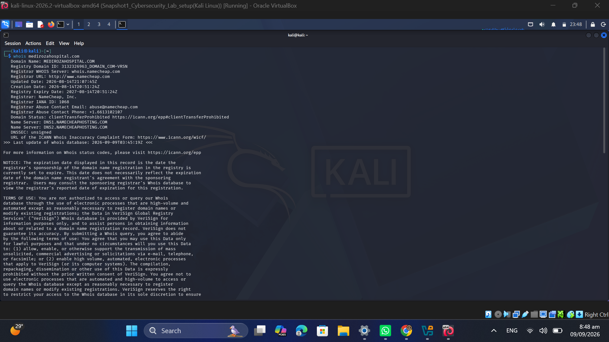

*Figure 1 — WHOIS reconnaissance.*

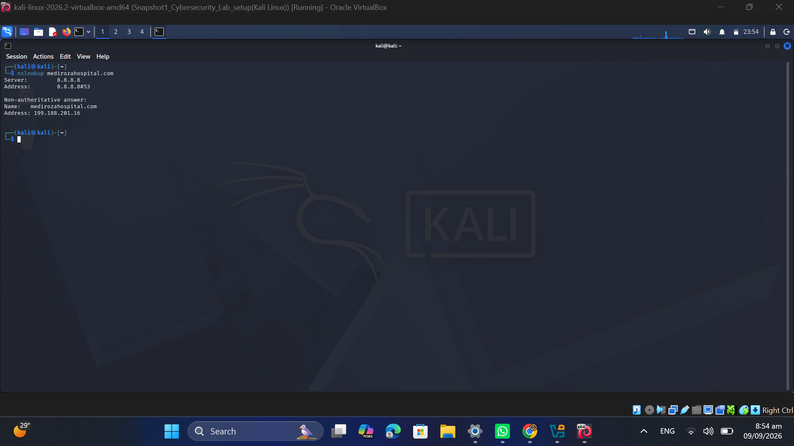

*Figure 2 — DNS resolution.*

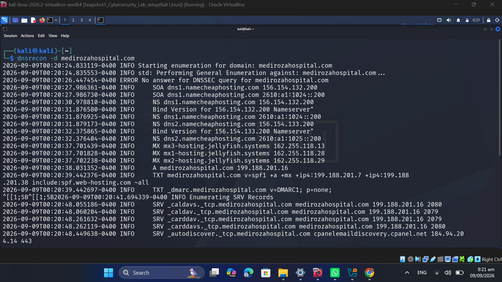

*Figure 3 — DNSRecon infrastructure enumeration.*

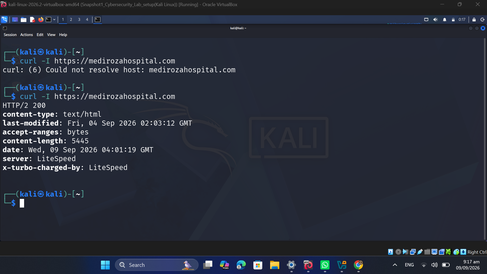

*Figure 4 — HTTP header inspection.*

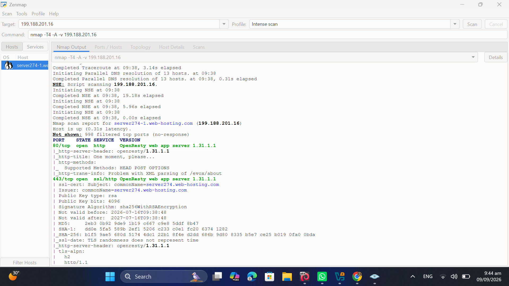

*Figure 5 — Nmap service and port assessment.*

**Status:** ✅ Completed

---

## 2️⃣ Directory Enumeration

Gobuster was used to enumerate potentially interesting directories and files.

The initial scan encountered a soft-404 / wildcard response behavior. The scan was subsequently refined by excluding the wildcard response length.

Example:

```bash
gobuster dir \
  -u https://medirozahospital.com \
  -w /usr/share/wordlists/dirb/common.txt \
  -x php,txt,bak,zip \
  --exclude-length <wildcard_length> \
  -o gobuster_result.txt
```

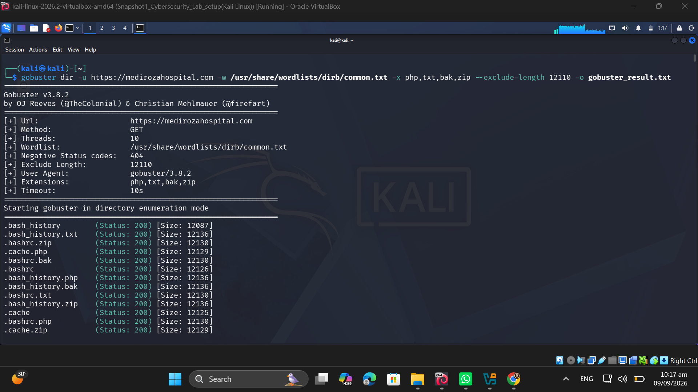

*Figure 6 — Gobuster configuration.*

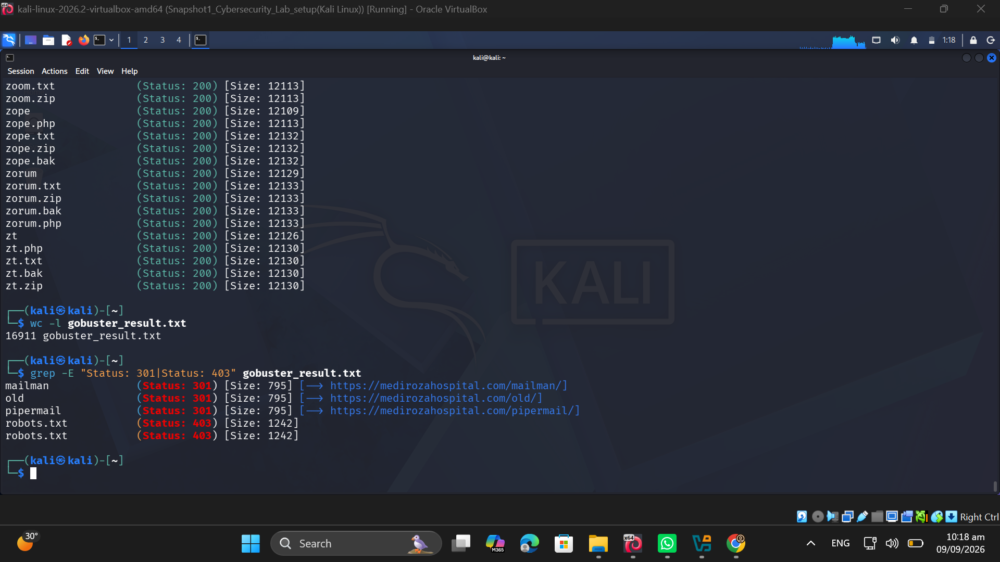

*Figure 7 — Filtered enumeration results.*

The enumeration identified potentially sensitive paths including:

```text
/old/
/mailman/
/pipermail/
/robots.txt
```

**Status:** ✅ Completed

---

## 3️⃣ Sensitive Paths Disclosed by `robots.txt`

The publicly accessible `robots.txt` file was reviewed.

```bash
curl -s https://medirozahospital.com/robots.txt
```

Observed content:

```text
User-agent: *
Disallow: /patient/
Disallow: /staff/
Disallow: /old/

Sitemap: https://medirozahospital.com/sitemap.xml
```

### Observation

`robots.txt` is designed to provide crawler instructions. It is **not an access-control mechanism**.

The presence of sensitive path names provided an attacker with useful reconnaissance information.

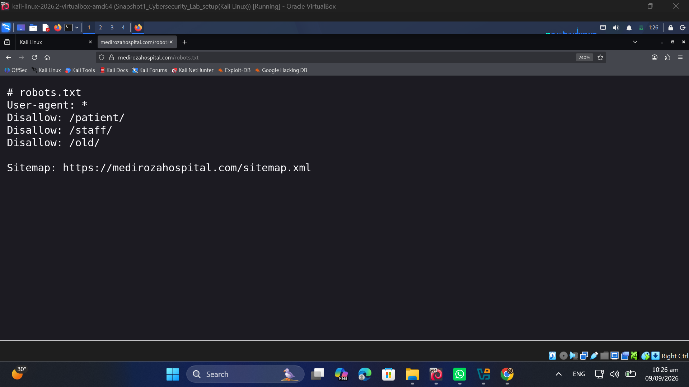

*Figure 8 — Sensitive paths disclosed through robots.txt.*

**Status:** ✅ Completed

---

# Phase 02 — Authentication Bypass via SQL Injection (M1)

## 4️⃣ Baseline Authentication Testing

The patient login functionality was tested using invalid credentials to establish a baseline response.

The application returned a username-specific error:

```text
Username not found
```

This behavior may enable **username enumeration**, corresponding to information-disclosure weaknesses such as CWE-203.

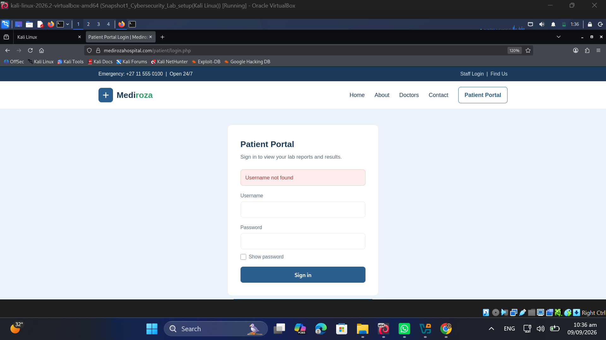

*Figure 9 — Username-specific authentication error.*

**Status:** ✅ Completed

---

## 5️⃣ SQL Injection Confirmation

A controlled input-validation test resulted in a verbose database error.

Observed error behavior indicated that user input was reaching the database query without appropriate parameterization.

Example error pattern:

```text
Warning: mysqli_query(): You have an error in your SQL syntax;
check the manual that corresponds to your MySQL server version
for the right syntax to use near ... at line 1
```

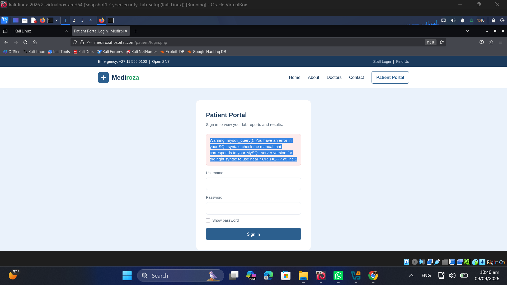

*Figure 10 — Verbose MySQL error demonstrating unsafe input handling.*

### Security Impact

The behavior was consistent with a **CWE-89 SQL Injection** condition.

SQL injection occurs when untrusted input is incorporated into a database query without safe parameterization.

**Status:** ✅ Confirmed

---

## 6️⃣ Authentication Bypass

Within the authorized training environment, a controlled SQL injection test demonstrated that the authentication logic could be manipulated to bypass the intended credential validation.

The resulting session provided access to the restricted patient portal.

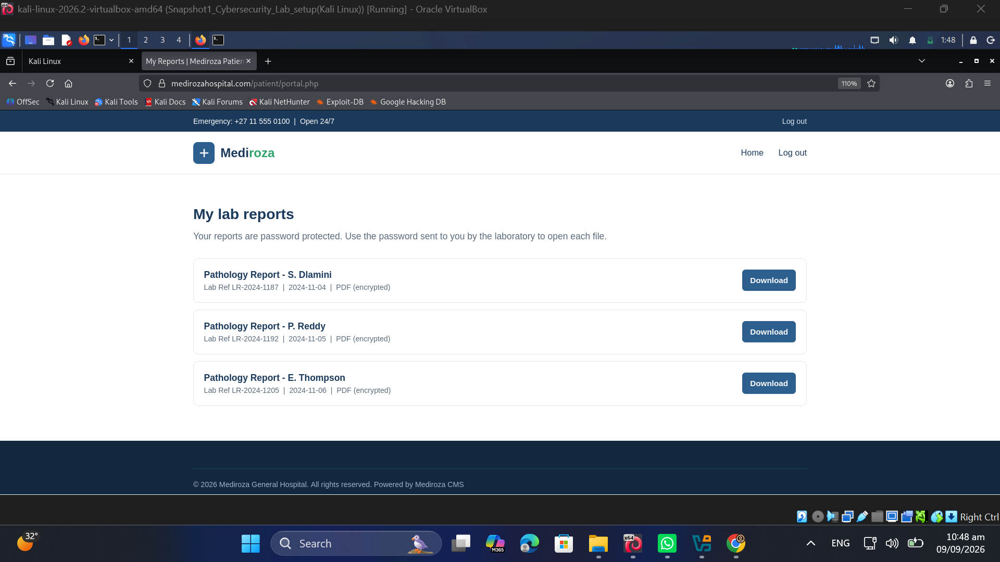

*Figure 11 — Authorized demonstration of authentication bypass and portal access.*

The portal exposed three pathology reports:

| Report | Lab Reference |
|---|---|
| Pathology Report — S. Dlamini | `LR-2024-1187` |
| Pathology Report — P. Reddy | `LR-2024-1192` |
| Pathology Report — E. Thompson | `LR-2024-1205` |

> **Impact:** Authentication controls were effectively bypassed, resulting in unauthorized access to protected application functionality within the training environment.

**Status:** ✅ Completed — Authentication bypass confirmed

---

# Phase 03 — Protected Data Exfiltration & Cryptanalysis (M2)

## 7️⃣ Protected Lab Report Retrieval

Following the authorized portal compromise, three password-protected pathology reports were retrieved for controlled security analysis.

| File | Lab Reference | Protection |
|---|---|---|
| `patient_report_1.pdf` | `LR-2024-1187` | PDF open password |
| `patient_report_2.pdf` | `LR-2024-1192` | PDF open password |
| `patient_report_3.pdf` | `LR-2024-1205` | PDF open password |

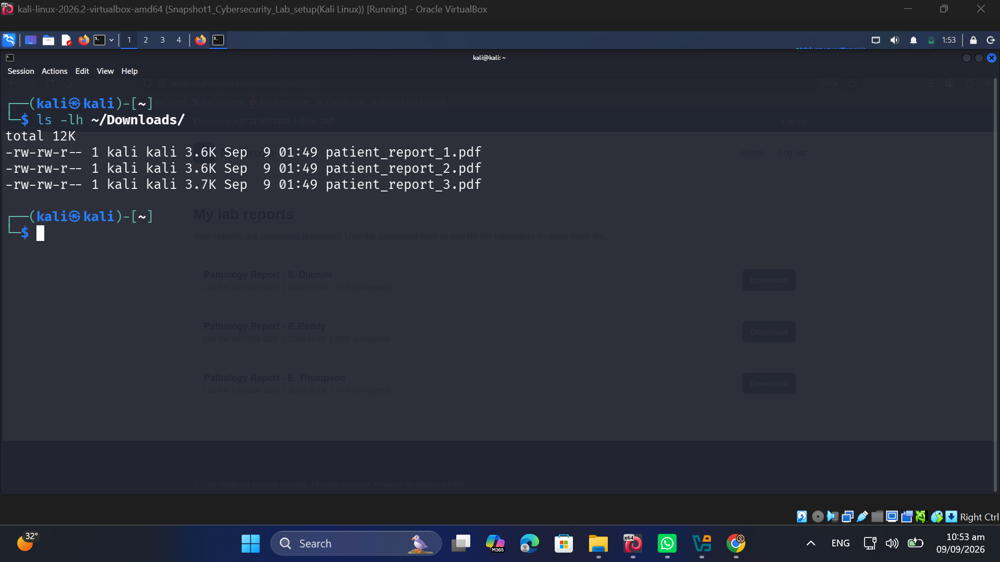

*Figure 12 — Retrieved pathology PDF reports.*

**Status:** ✅ Completed

---

## 8️⃣ PDF Hash Extraction & Password Testing

The protected PDFs were processed through the authorized training tooling to extract password-verification material suitable for offline security testing.

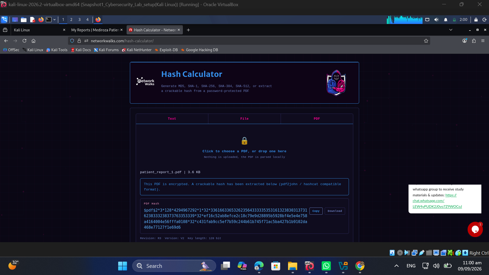

*Figure 13 — PDF password-hash extraction.*

### Results

| Target | Protection Parameters | Result | Approx. Duration |
|---|---|---|---|
| `patient_report_1.pdf` | Revision R3 / V2 / 128-bit | Weak password recovered | Seconds |
| `patient_report_2.pdf` | Revision R3 / V2 / 128-bit | Weak password recovered | Seconds |
| `patient_report_3.pdf` | Revision R3 / V2 / 128-bit | Weak password recovered | Seconds |

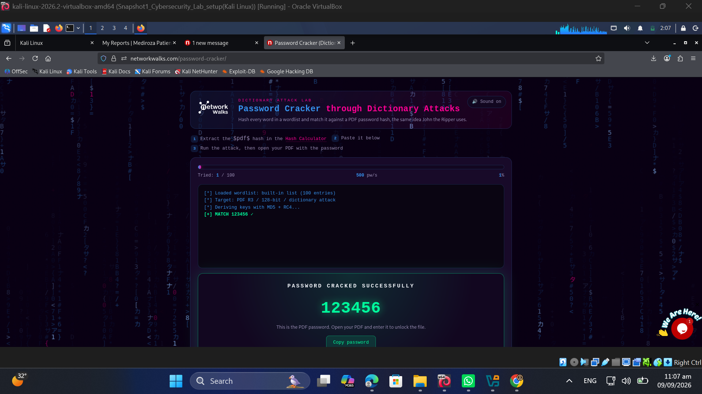

*Figure 14 — Authorized password recovery test for report 1.*

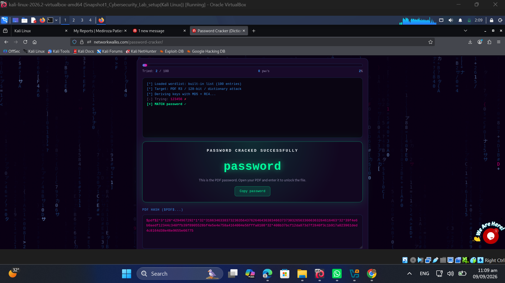

*Figure 15 — Authorized password recovery test for report 2.*

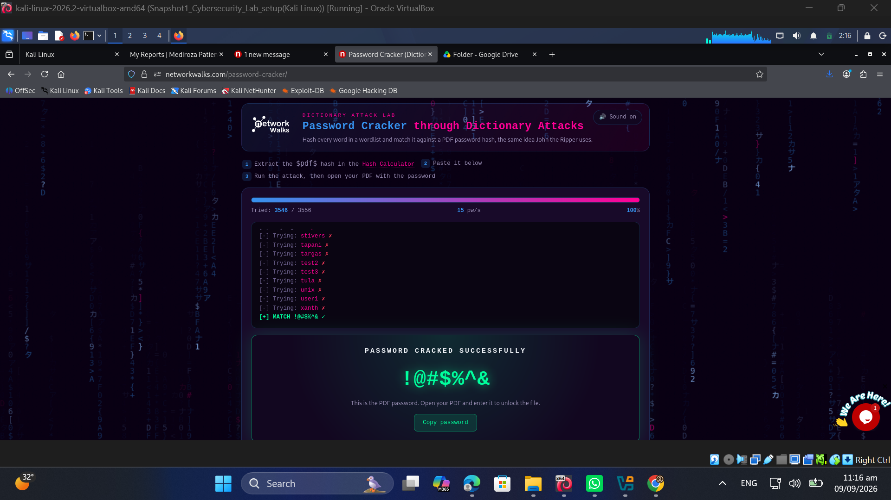

*Figure 16 — Authorized password recovery test for report 3.*

### Finding

The document passwords were sufficiently weak to be recovered rapidly through dictionary-based testing.

This demonstrates that password-protected documents should not rely on easily guessable passwords as their primary security control.

**Status:** ✅ Completed — 3/3 document passwords recovered

---

## 9️⃣ Medical Document Access

Using the recovered document passwords, the protected reports were successfully opened during the authorized assessment.

The documents contained sensitive medical information, demonstrating the potential impact of combining:

```text
SQL Injection
      +
Authentication Bypass
      +
Weak Document Passwords
      =
Medical Data Exposure
```

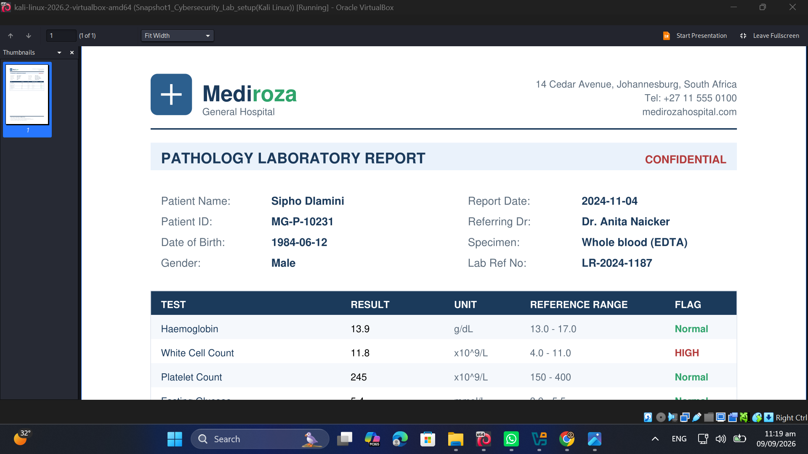

*Figure 17 — Authorized analysis of pathology report 1.*

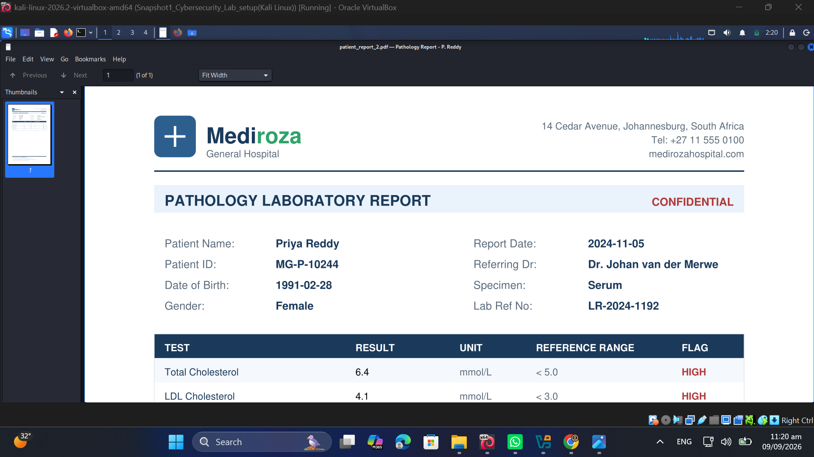

*Figure 18 — Authorized analysis of pathology report 2.*

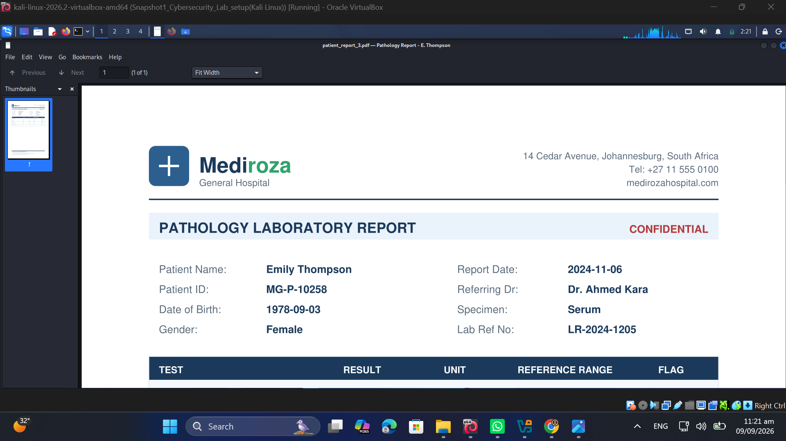

*Figure 19 — Authorized analysis of pathology report 3.*

### Potentially Exposed Data Categories

The reports contained categories of protected health information such as:

- Patient names
- Patient identifiers
- Dates of birth
- Demographic information
- Referring physician information
- Laboratory results
- Clinical result indicators

> **Impact:** Weak document protection significantly reduced the security provided by PDF password encryption once the files had been obtained.

**Status:** ✅ Completed — Protected medical document exposure demonstrated

---

# Phase 04 — Metadata Leak & Database Dump Exposure (M3)

## 🔟 PDF Metadata Analysis

The retrieved documents were analyzed beyond their visible content using metadata inspection.

Example:

```bash
exiftool -password '<recovered_password>' patient_report_3.pdf
```

A document metadata field contained an internal operational comment referencing the location of an old database backup.

Observed metadata pattern:

```text
Comments: DB backup moved to /old before site migration, do not delete
Author:   j.malik
```

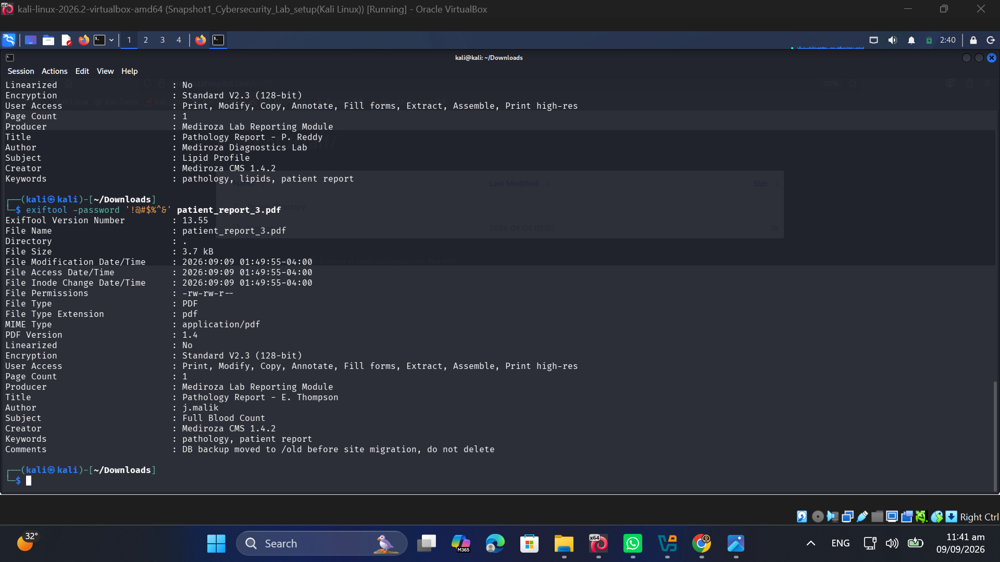

*Figure 20 — PDF metadata exposing an internal operational note.*

### Security Impact

The metadata represented an information-disclosure issue because internal operational details had been embedded in a patient-facing document.

It also provided an additional clue regarding the legacy `/old/` directory.

**Status:** ✅ Completed

---

# 1️⃣1️⃣ Directory Listing & Legacy Backup Exposure

The previously identified directories were inspected as part of the authorized assessment.

Example requests:

```bash
curl -s -i https://medirozahospital.com/staff/
curl -s -i https://medirozahospital.com/old/
```

The directories returned browsable file listings, indicating that directory indexing was enabled.

### Finding

Directory autoindexing exposed filenames and directory contents without requiring authentication.

This configuration can expose:

- Backup files
- Temporary files
- Source code
- Logs
- Configuration files
- Old application versions
- Database dumps

**Status:** ✅ Completed

---

# 1️⃣2️⃣ Publicly Accessible SQL Backup

An SQL database backup was identified within the exposed legacy directory.

The backup was retrievable without authentication in the authorized environment.

```text
mediroza_db_backup_2019.sql
```

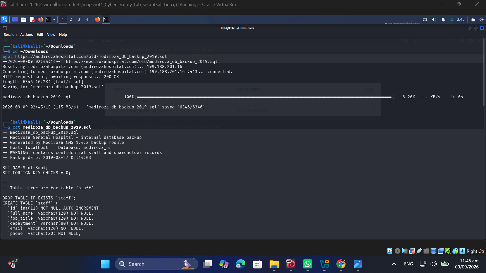

*Figure 21 — Authorized inspection of the exposed SQL backup.*

### Finding

The backup represented a **Critical information exposure** because database backups should never be directly accessible from a public web directory.

**Status:** ✅ Completed — Database backup exposure confirmed

---

# 1️⃣3️⃣ Database Analysis

The SQL dump was reviewed to determine the categories of information exposed.

### `staff` Table

The exposed staff dataset contained approximately 30 employee records with information including:

- Full names
- Job titles
- Departments
- Work email addresses
- Phone numbers
- National identification numbers
- Salary information

### `shareholders` Table

The shareholder information included:

- Shareholder names
- Share percentages
- Share classes
- Corporate ownership information

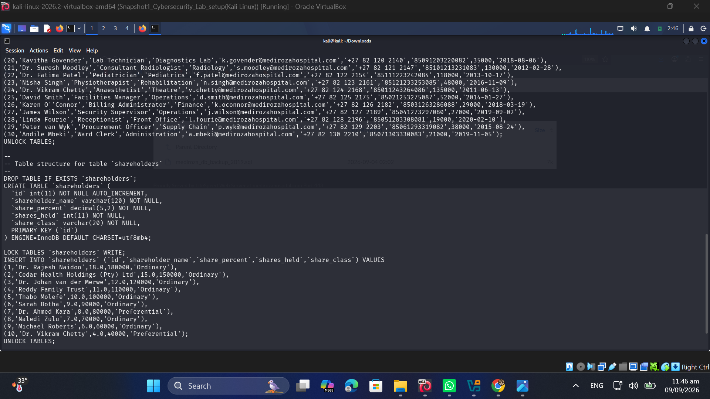

*Figure 22 — Authorized analysis of exposed staff and shareholder tables.*

> **Important:** Actual sensitive records should **not** be committed to a public GitHub repository. Any screenshots or exported datasets uploaded to this repository should be redacted so that real names, IDs, phone numbers, emails, salaries and other sensitive information are not exposed.

### Access-Control Validation

Additional application paths were tested to determine whether the exposure was systemic or isolated.

Some protected paths correctly returned:

```text
HTTP/1.1 403 Forbidden
```

This demonstrated inconsistent access-control enforcement across different areas of the application.

**Status:** ✅ Completed — Critical data exposure confirmed

---

# ⛓️ Attack Path & Kill Chain

The following diagram summarizes the primary attack chains identified during the assessment.

```text
                         ┌──────────────────────┐
                         │   RECONNAISSANCE     │
                         └──────────┬───────────┘
                                    │
                                    ▼
                         ┌──────────────────────┐
                         │     robots.txt       │
                         │ /patient/ /staff/    │
                         │       /old/          │
                         └──────────┬───────────┘
                                    │
                    ┌───────────────┴───────────────┐
                    │                               │
                    ▼                               ▼
          ┌──────────────────┐            ┌──────────────────┐
          │ Patient Login    │            │   /old/          │
          │ login.php        │            │ Directory Listing│
          └────────┬─────────┘            └────────┬─────────┘
                   │                               │
                   ▼                               ▼
          ┌──────────────────┐            ┌──────────────────┐
          │ SQL Injection    │            │ SQL Backup       │
          │ Authentication   │            │ Exposure         │
          │ Bypass           │            └────────┬─────────┘
          └────────┬─────────┘                     │
                   │                               ▼
                   ▼                      ┌──────────────────┐
          ┌──────────────────┐            │ Staff PII        │
          │ Patient Portal   │            │ Salaries         │
          └────────┬─────────┘            │ Shareholders     │
                   │                      └──────────────────┘
                   ▼
          ┌──────────────────┐
          │ 3x Patient PDFs  │
          └────────┬─────────┘
                   │
                   ▼
          ┌──────────────────┐
          │ Weak PDF         │
          │ Passwords        │
          └────────┬─────────┘
                   │
                   ▼
          ┌──────────────────┐
          │ Protected Health │
          │ Information      │
          │ Exposure         │
          └──────────────────┘
```

---

# 📈 Risk Analysis

## Critical Findings 🔴

### 1. SQL Injection Authentication Bypass

**Severity:** Critical  
**Category:** CWE-89 / OWASP A03 — Injection

The authentication mechanism failed to safely handle user-controlled input, allowing authentication logic to be manipulated.

**Impact:**

- Authentication bypass
- Unauthorized portal access
- Exposure of protected application functionality
- Potential access to sensitive patient records

---

### 2. Public SQL Backup Exposure

**Severity:** Critical  
**Category:** Security Misconfiguration / Sensitive Data Exposure

A legacy database backup was located within a publicly accessible web directory.

**Impact:**

- Staff PII exposure
- Salary disclosure
- National ID exposure
- Corporate ownership information exposure
- Potential database compromise

---

## High Findings 🟠

### 3. Weak PDF Password Protection

Document passwords were sufficiently weak to be recovered through dictionary-based testing.

**Impact:**

- Reduced confidentiality of protected documents
- Offline password attacks
- Exposure of sensitive medical documents after file acquisition

---

### 4. Inconsistent Access Control

Some sensitive paths were exposed while related application paths correctly returned `403 Forbidden`.

**Impact:**

- Attackers may discover alternate paths around security controls.
- Legacy resources may remain unintentionally accessible.

---

### 5. Publicly Accessible Legacy Backup

A stale backup from 2019 remained accessible from the web.

**Impact:**

- Historical data exposure
- Increased attack surface
- Potential leakage of obsolete credentials/configuration/data

---

## Medium Findings 🟡

### 6. Sensitive PDF Metadata

Internal operational information was embedded in a patient-facing document.

**Impact:**

- Infrastructure disclosure
- Internal workflow disclosure
- Additional attack-path information

---

### 7. Verbose Database Errors

Detailed database errors were exposed to the client.

**Impact:**

- Database technology disclosure
- SQL query structure clues
- Easier vulnerability confirmation

---

## Low Finding 🟢

### 8. Sensitive Paths in `robots.txt`

Sensitive directories were explicitly listed in a publicly accessible crawler configuration file.

**Impact:**

- Improved reconnaissance
- Reduced effort required to discover restricted paths

> `robots.txt` should never be considered an access-control mechanism.

---

# 🧠 Vulnerability Overview

## What is SQL Injection?

SQL Injection occurs when untrusted input is incorporated into a database query without appropriate parameterization.

Conceptually:

```text
User Input
    ↓
Application
    ↓
Unsafe SQL Construction
    ↓
Database Query Manipulation
```

### Recommended Protection

Use parameterized queries / prepared statements:

```text
User Input
    ↓
Parameterized Query
    ↓
Database
```

This prevents user-controlled data from being interpreted as SQL syntax.

---

## What is Directory Listing?

Directory listing occurs when a web server automatically displays the contents of a directory when no index resource is present.

Example:

```text
/old/
├── backup.sql
├── old.zip
├── config.bak
└── temporary.txt
```

If the directory is publicly accessible, an attacker may obtain sensitive files without exploiting the application itself.

---

## Why Are Weak PDF Passwords Dangerous?

Password-protected documents may still be vulnerable to offline password attacks if weak passwords are selected.

Common examples include:

```text
Dictionary words
Short numeric sequences
Keyboard patterns
Common passwords
Predictable phrases
```

Strong document security requires both appropriate encryption and strong key/password management.

---

# 🛡️ Remediation Recommendations

## 1. Fix SQL Injection — Critical

- Use prepared statements / parameterized queries.
- Never concatenate user input directly into SQL queries.
- Implement server-side input validation.
- Use least-privilege database accounts.
- Suppress database errors from production responses.
- Log detailed errors server-side.
- Implement authentication rate limiting.
- Add security monitoring for repeated authentication anomalies.
- Perform secure code review of all database interaction points.

---

## 2. Strengthen Document Protection — High

- Enforce strong password policies.
- Block common and breached passwords.
- Use cryptographically random document keys where appropriate.
- Avoid predictable document passwords.
- Use modern encryption mechanisms where supported.
- Protect document delivery through authenticated application controls.
- Review the lifecycle of sensitive documents.

---

## 3. Remove Sensitive Paths from `robots.txt` — Low

Do not use `robots.txt` as an access-control mechanism.

Instead:

```text
Public Resource
      ↓
Web Server / Application
      ↓
Authentication & Authorization
      ↓
Allow / Deny
```

Sensitive paths should be protected at the server or application layer.

---

## 4. Remove Sensitive PDF Metadata — Medium

Before distributing patient-facing documents:

- Remove internal comments.
- Remove unnecessary author information.
- Remove filesystem paths.
- Remove internal usernames.
- Sanitize document metadata.
- Implement automated metadata inspection during document generation.

---

## 5. Disable Directory Listing — Critical

Directory indexing should be disabled unless explicitly required.

Recommended actions:

- Disable autoindexing.
- Remove unnecessary legacy directories.
- Protect administrative directories.
- Review web-server configuration.
- Audit all publicly accessible directories.

---

## 6. Remove Public Database Backups — Critical

Database backups must never be stored in a publicly accessible web root.

Recommended architecture:

```text
Web Root
   │
   ├── Public Application Files
   │
   └── No Database Backups
            │
            ▼
     Secure Backup Storage
            │
            ├── Access Control
            ├── Encryption
            ├── Monitoring
            └── Retention Policy
```

Immediately remove legacy SQL dumps and similar files such as:

```text
*.sql
*.sql.gz
*.bak
*.backup
*.zip
*.tar
*.tar.gz
```

from public web directories.

---

## 7. Implement Secure Data Retention

The presence of an old database backup demonstrates the need for a formal retention process.

Organizations should:

- Define backup retention periods.
- Encrypt backups at rest.
- Restrict backup access.
- Monitor backup access.
- Securely delete expired backups.
- Regularly audit public-facing infrastructure.

---

## 8. Improve Access-Control Consistency

All sensitive resources should enforce authorization consistently.

Test:

```text
Application Routes
       ↓
Authentication
       ↓
Authorization
       ↓
Resource Access
```

Do not rely solely on obscurity or URL naming conventions.

---

## 9. Improve Logging & Monitoring

Implement monitoring for:

- Repeated failed login attempts
- Authentication anomalies
- SQL injection indicators
- Access to backup files
- Requests for sensitive extensions
- Unexpected directory enumeration
- Access to administrative endpoints

---

## 10. Conduct Regular Security Assessments

Recommended activities include:

- Regular penetration testing
- Secure code review
- Dependency scanning
- Configuration reviews
- Web application vulnerability assessments
- Backup exposure audits
- Access-control testing
- Security awareness training

---

# 📊 Findings Matrix

| Finding | CWE / Category | Severity | Exploitability | Business Impact | Priority |
|---|---|---|---|---|---|
| SQL Injection Authentication Bypass | CWE-89 | 🔴 Critical | High | Critical | P1 |
| Public SQL Backup | Sensitive Data Exposure | 🔴 Critical | High | Critical | P1 |
| Directory Listing | Security Misconfiguration | 🔴 Critical | High | High | P1 |
| Weak PDF Passwords | Weak Authentication / Crypto | 🟠 High | High | High | P1 |
| Inconsistent Access Control | Access Control | 🟠 High | Medium | High | P1 |
| PDF Metadata Disclosure | Information Disclosure | 🟡 Medium | Medium | Medium | P2 |
| Verbose DB Errors | CWE-209 | 🟡 Medium | Medium | Medium | P2 |
| robots.txt Disclosure | Information Disclosure | 🟢 Low | High | Low | P3 |

---
# 🔐 Security & Ethics

This repository is intended strictly for:

- Educational purposes
- Authorized penetration testing
- Defensive security research
- Cybersecurity training
- Secure-development awareness

All testing described in this project was performed against an environment for which authorization was provided as part of the training engagement.

> **Disclaimer:** Never test systems, applications, accounts, networks or data without explicit authorization. Unauthorized access or testing may violate applicable laws and regulations.

The techniques documented in this repository should only be reproduced against systems that you own or have explicit permission to assess.


---

# 👤 Author

**Muhammad Ahsan** <br>

🔗 LinkedIn: [linkedin.com/in/mahsan-mushtaq](https://www.linkedin.com/in/mahsan-mushtaq/) <br>  
Cybersecurity Student — Networkwalks Academy

---

# 📋 Project Information

| Field | Detail |
|---|---|
| **Program** | Networkwalks Academy — Cybersecurity Training |
| **Project** | Web Application Penetration Testing |
| **Milestones** | M1–M4 |
| **Assessment Type** | External Black-Box Penetration Test |
| **Target** | Mediroza General Hospital Training Environment |
| **Testing Platform** | Kali Linux 2026.2 |
| **Report Date** | 02 October 2026 |
| **Status** | Completed |
| **Primary Focus** | Web Application Security |

---

# 📚 Key Security Concepts Demonstrated

This project demonstrates practical understanding of:

- 🔎 Reconnaissance
- 🌐 DNS Enumeration
- 🔍 Web Directory Enumeration
- 🤖 `robots.txt` Analysis
- 💉 SQL Injection
- 🔐 Authentication Bypass
- 📄 PDF Security
- 🔑 Password Security
- 🧪 Offline Password Testing
- 📝 Metadata Analysis
- 📂 Directory Listing
- 💾 Database Backup Exposure
- 👤 PII Protection
- 🏥 PHI Protection
- 🛡️ Security Hardening
- 📊 Risk Assessment
- 🔒 Access Control

---

# ⭐ Final Assessment

The assessment demonstrated that seemingly separate weaknesses can combine into a much larger security impact.

```text
Information Disclosure
        +
SQL Injection
        +
Weak Authentication
        +
Weak Document Passwords
        +
Directory Listing
        +
Public Database Backup
        ↓
Significant Confidentiality Risk
```

The highest-priority remediation actions are:

1. **Fix SQL Injection immediately.**
2. **Remove database backups from the public web root.**
3. **Disable directory listing.**
4. **Strengthen authentication and access controls.**
5. **Strengthen document encryption and password management.**
6. **Remove sensitive metadata from patient-facing documents.**
7. **Implement secure backup retention and storage.**
8. **Perform a complete post-remediation security assessment.**

---

## 📌 Conclusion

This project highlights the importance of **defense in depth**.

A secure web application requires more than a working login page or password-protected documents. Authentication, authorization, input validation, server configuration, backup management, document security, metadata hygiene and monitoring must all work together.

The assessment provides a practical demonstration of how a small configuration or development weakness can become significantly more serious when combined with other weaknesses.

---

> **Learn • Practice • Build • Secure**
>
> **Networkwalks Academy**
